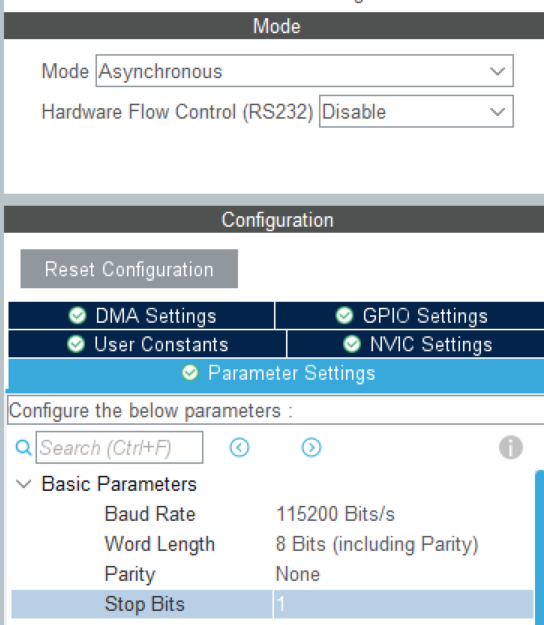
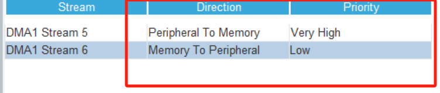

- [cube 配置](#cube配置)
- [代码例程](#代码例程)
- [注意](#注意)

# readme

## cube 配置


如上，确定好要的波特率和长度以及校验



- 注意：若需要使用 DMA，记得启用并根据实际情况配置 <优先级>,以防接收不到数据

## 代码例程

1.引用命名空间后，需要创建一个结构体 //usart_init_t i 2.为其赋值// rxbuf_size,rx/tx_callback 函数，接收发送发送等，具体看 hpp,根据需求不做初始化也可以 3.之后便可以创建类 //usart_c example(usart_init) 4.若有使能中断，则在进入中断后会自动进入自定义的 callback 函数
例程如下：

```language
    void tx_call()
    {
        int i = 0;
    }
    void rx_call(uint8_t *buff, uint16_t size)
    {
        int i = 0;
    }
    uint8_t rx1[286] = {0};
     Config usart_con =
        {
       .handle =  &huart2, //hal库usart句柄
       .rxbuf_size = 10,        //接收区缓冲大小
       .expected_data_length = usart_data_length
       .rx_type = USART_RX_DMA_IDLE, //接收类型
       .tx_type = USART_TX_DMA,      //发送类型
       .rx_callback = rx_call;
       .tx_callback = tx_call;
       .rx_buffer = rx1,                 //发送区指针
       .sec_rx_buffer = rx2 //接收区指针--双地址时用
        };
    USART_c test(usart_con);
    uint8_t tx_b[10] = {10, 10, 2, 1};
    test.start_receive();
    while (1)
    {
    test.send(tx_b, 4, 500);
    HAL_Delay(500);
    }
```

