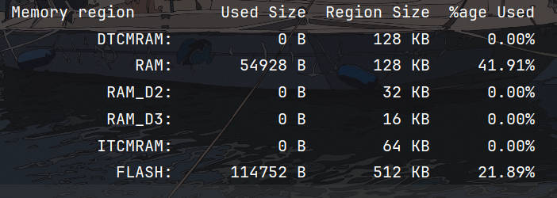
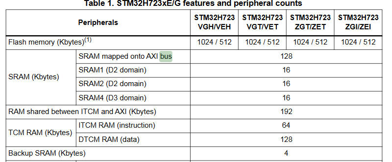
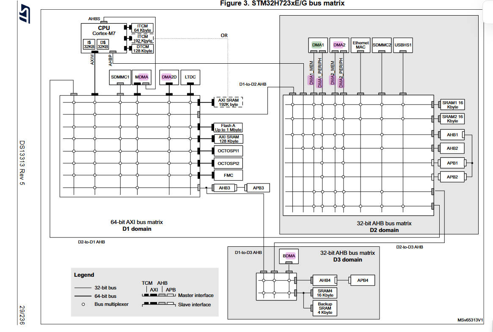
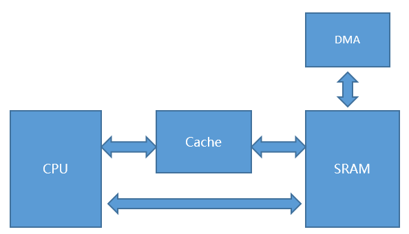

## 省流
1. TCM区是所有SRAM区频率最高的，将数据存放在DTCM中可以使程序运行速度最快化。
2. 看一下每个SRAM的初始地址和内存大小（Kbytes）
3. 每个SRAM区支持哪些DMA，若使用不支持访问该SRAM区的DMA，DMA将无法搬运数据
**所以！要更改ld文件使DMA正常运作，ld文件在你的项目根目录下，没改成功的现象是可以进中断，缓冲区无内容，改没改成功要看编译结果**

## 扫盲
#### RAM
- 举例stm32h7的相关RAM内容，RAM是掉电不丢失数据，理解为内存条，总体先分为4块内存：ITCMRAM,DTCMRAM,SRAM,BACKUPSRAM,SRAM又分为四个部分，AXISRAM(D1域),SRAM1(D2域),SARM2(D2域),SARM3(D3域)

- ITCMRAM和DTCMRAM
TCM是Tightly-Coupled Memory 紧密耦合内存，这两个是直连CPU的，因为与内核直接相连TCM的速度可以达到和内核一致。后面地址建议过两眼，让你调试的时候对变量地址更敏感。
ITCM （指令紧密耦合内存）64Kbytes 0x00000000 ~ 0x0000FFFF，ITCM只用于运行程序代码，不储存数据。
DTCM （数据紧密耦合内存）128Kbytes 0x20000000 ~0x2001FFFF，DTCM用于存储数据，且它的速度与内核一致。
支持的DMA访问：仅支持 MDMA
- SRAM
  1. (D1 domain) 
    AXISRAM 128Kbytes 0x24000000~0x2401FFFF
    SRAM mapped onto AXI bus (SRAM映射在AXI总线),在 STM32H7 系列微控制器的 D1 域（D1 Domain）中,用途不限，可以用于用户应用数据存储或者LCD显存。
   （其实还有个RAM shared between ITCM and AXI （ITCM和AXI SRAM的共享内存）大小为192Kbytes，这段内存可以配置为ITCM和AXI SRAM）
   支持的DMA访问：支持 MDMA，DMA1 和 DMA2，不支持 BDMA
  2. (D2 domain) 
    SRAM1 16Kbytes 0x30000000 ~ 0x30003FFF
    SRAM2 16Kbytes 0x30004000 ~ 0x30007FFF
    可用作 DMA 缓冲区，用于存储 D2 域中外设的输入/输出数据
    支持的DMA：支持MDMA，DMA1和 DMA2，不支持 BDMA
  3. (D3 domain)
    SRAM4 16Kbytes 0x38000000 ~ 0x38003FFF
    可以用作 BDMA 缓冲区，用于在 D3 域中存储外设的输入/输出数据。当 D1 和 D2 域进入 DStandby 模式时，也可以用来保留一些应用代码/数据。
    支持的DMA：支持所有的DMA
    数据手册中也可以查到关键词bus master

- 将程序的核心代码（如数学解算、RTOS等关键的实时数据）放入TCM区，将需要使用DMA1、DMA2（如DT7遥控器数据）或大量数据（如裁判系统数据）存放至AXI SRAM区（其实大量数据传输往往使用DMA传输）。对于RoboMaster来说，128Kbytes+128Kbytes应该是足够的，不够的话后面还有三个16Kbytes区
  
https://zhuanlan.zhihu.com/p/4218673539 王草凡——SRAM区详解和DMA1、2无法访问TCM的解决方法
以上F4的同理可以找到64K的CCM(仅CPU可访问)、112K的SRAM1(主RAM)和16K的SRAM2(外设使用)

#### 链接器（.ld）
- 编译器管理编译与依赖，链接器管理内存布局与链接，gcc把代码翻译为目标文件（.o）后链接脚本（.ld）把目标文件放到指定内存布局生成可烧录文件
- 链接脚本可以帮助你管理和优化程序的内存使用，确保代码和数据被放置在正确的位置，避免冲突和溢出问题，这对于确保程序的正确运行是非常重要的
RAM：用于存储变量和程序数据。
ROM：用于存储程序代码和常量数据。（常指flash）
Stack：用于存储局部变量和函数调用的返回地址。
Heap：用于动态内存分配。
- 链接脚本的组成部分
  1. MEMORY区块的定义和属性
    在MEMORY区块中，我们可以定义各种内存区域及其属性，如只读(ROM)或读写(RAM)。我们还可以定义每个区域的大小和起始地址。
  2. SECTIONS的定义及其内部段的详解 (.text, .data, .bss等)
  .text：存放程序代码和常量数据。
  .data：存放已初始化的全局和静态变量。
  .bss：存放未初始化的全局和静态变量。
  1. 符号定义 (提供的符号和用户定义的符号)
  在链接脚本中，我们可以定义符号来表示特定的地址或值，这样可以在我们的程序中使用它们。

  https://blog.csdn.net/shenjin_s/article/details/88712249 感兴趣看ld文件详解

#### Cache和MPU
MPU（Memory Protection Unit）：ARM内核（如 Cortex-M7）内置的一个内存访问管理单元
功能：控制不同内存区域的访问属性（可读/可写/可执行）；设置 Cache、Buffer、Share 属性（决定是否开启 D-Cache / I-Cache）；防止程序误访问内存（保护内存安全）；划分外设、RAM、Flash 的访问策略

Cache（高速缓存）是CPU内部用来**加速访问外部内存SRAM**的**小型**高速存储。访问外部内存（如SRAM）时从 Cache取数据很快（直连CPU）；SRAM 取然后更新就慢，所以Cache提高性能，但数据可能不同步（特别是 DMA 在用内存时）
Cortex-M7 有两个：
I-Cache（指令缓存）：存程序指令
D-Cache（数据缓存）：存数据

- 对比SRAM+Cache和DTCM
用SRAM+Cache的方式我们不用到DTCM（上面说的将程序数学解算放入TCM区，将需要使用DMA1、DMA2存放至AXI SRAM区）也可以加速解算

