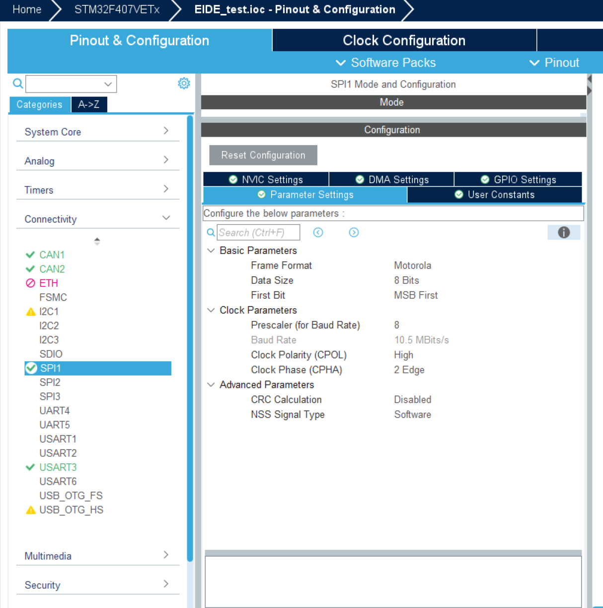
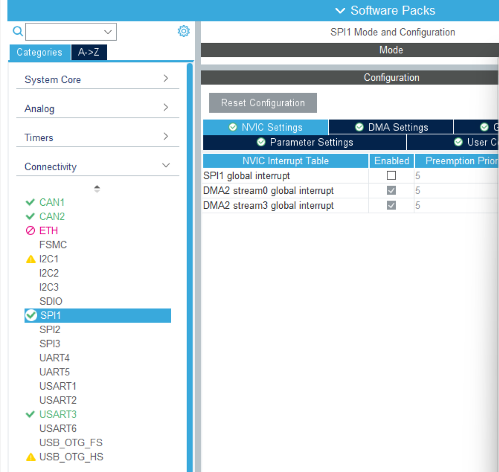
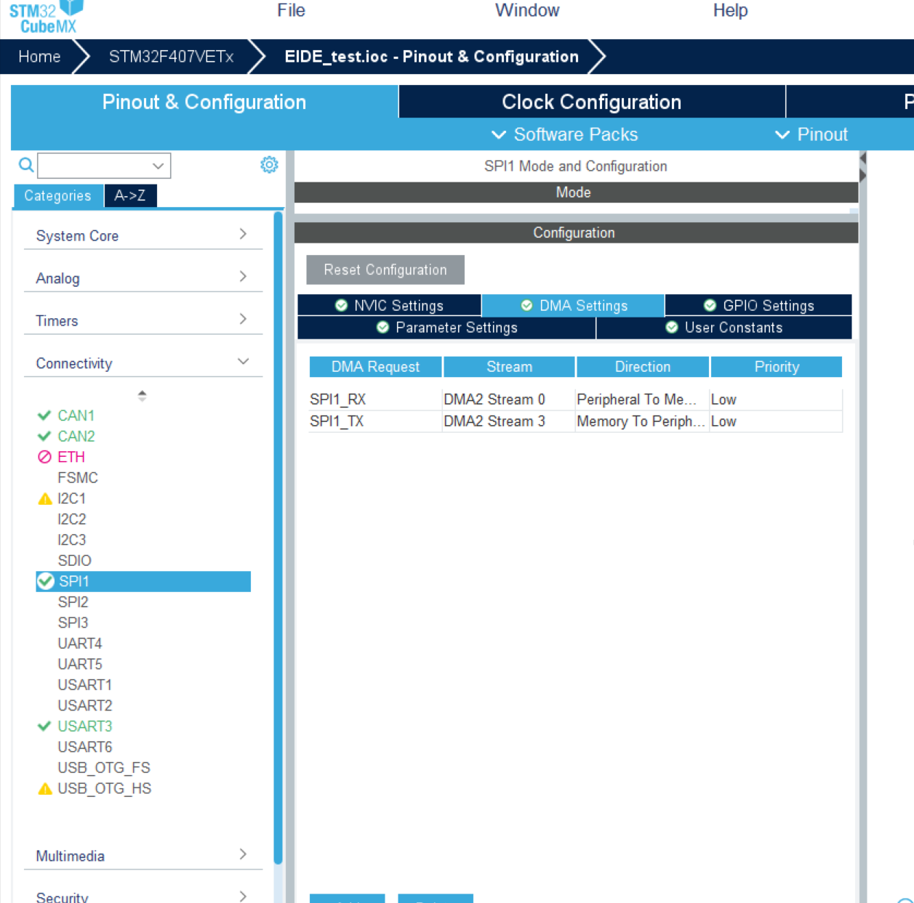
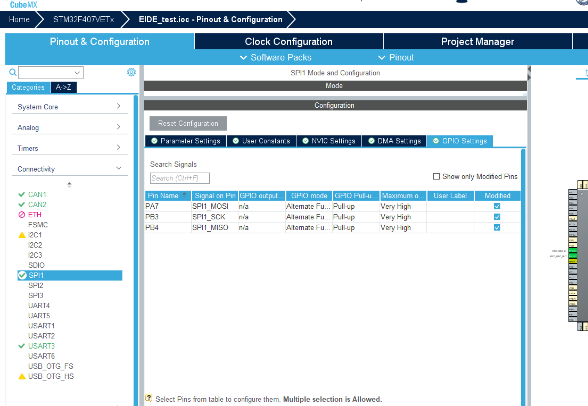

## ACE_ECF_26 IMU BMI088 模块使用教程

​	本模组基于老灯的088修改而成，解决了初始化过不去会超时的bug，增加了温控部分，未修改解算部分，解算为王工开源

​	用户只需要按照要求在cube中进行配置，打开rtos任务，调用唯一接口获取需要的数据即可，代码内所有配置内容均在imu_config.h内

​	在ACE F4 26.02.01主控的测试条件下，保yaw轴静态漂移程度可以控制在0.3deg/min

 

## 1.CUBEMX配置	

> 以STM32F405RGT6为例子 使用主控为ACE F4 26.02.01

### 	1.1SPI配置

​					 

​		注意 此处分频系数因主控频率，不同SPI在不同的时钟总线上频率不同，需要根据实际情况配置，使得Band Rate = 10Mbit/s

​					 

​					 

​					 

### 		1.2中断与片选引脚配置

###  			

注意 代码中依赖于User Label的宏定义识别引脚，此处需要保证该处名称准确

```
INT1_ACCEL
INT2_GYRO
CS1_ACCEL
CS2_GYRO
```

### 		1.3 TIM 配置

​				TIM用于温控产生PWM

​					  

​			注意 此处因为主控型号不同，ARR的值需要根据实际情况配置 ，目标是配置出1Khz 的PWM。此处数值基于温控开关MOS管型号计算得到的保守数值，使用型号为AO3400，若选型更改，需要重新计算。（硬件哥说短时间内不会更改了*2025/11/26*）

### 			1.4 FreeRtos配置

​					 

 					 

## 2.代码层配置

​	所有配置均在imu_config.h中

```
/********加热器参数********** */
/*
 * @warning  此处参数只适合ACE 26.02.01 F4主控，其余主控需要重新调教加热器参数
*/
//PID参数
#define Heater_Kp 7.f
#define Heater_Ki 0.f
#define Heater_Kd 0.f
#define Heater_maxIerror 10

#define Heater_forward 15//加热器前馈值
#define Init_temp 35.f//初始化前温度
#define Target_temp 40.f//目标温度
#define Max_temp 80.f//最高温度
#define Preheat_Timeout 20*1000//预热超时时间，单位ms
//TIM通道
#define IMU_HEATER_TIM &htim2
#define IMU_HEATER_TIM_CHANNEL TIM_CHANNEL_3
/************************************ */
//spi
#define BMI088_SPI &hspi1
//
#define isHeaterEnabled 1 //是否启用加热器
#define isCalibrate 1 //是否启用在线校准
/***********离线校准数据*************** */
// 需手动修改
#define GxOFFSET -0.0f
#define GyOFFSET -0.0f
#define GzOFFSET 0.0f
#define gNORM 9.6f

```

### 	2.1 加热器参数

​		加热器的控制系统组成为：PID输出 + Heater_forward。Heater_forward的值理论上为稳态情况下维持目标温度的占空比。在工况稳定的前提下，引入该值，可以使得系统更加稳定。且若不引入该值，PID输出为负值时，执行器无实际输出，导致PID控制器只有一半能用。

​		加热过程如下：上电后，加热器以满功率升温到Init_temp，后 切入PID控制，达到目标温度，等到温度稳定后，进入初始化。校准陀螺仪零点。

​		Preheat_Timeout控制的过程包括上电后到开始初始化的过程 

​		本版本从上电到整个校准结束耗时约27s

### 	2.2 离线校准

​			通过 isCalibrate 的定义，控制陀螺仪的零点漂移校准，若不启用在线校准，或在线校准超时，则会参考“离线校准数据”中的四个数据

> ​			可能导致在线校准超时（不是预热超时）的原因有：校准时机体存在扰动，片选线配置错误

​			yaw轴的漂移程度极其吃校准精度，校准过程中任何外界扰动都会影响校准进度，**建议提醒上场队员在陀螺仪校准过程中，不要触碰机器人！**

​			本版本的加热器控制调教一般，在冷板上电后会导致校准过程中温度有变化，建议在debug环境下，等待温度稳定后，反复重跑程序，得到yaw轴漂移最少的一组数据作为离线校准数据。不同板子的校准数据需要单独校准

 

​			到底是在线校准准确还是得到一组准确的离线数据不进行在线校准准确，有待后续长期观察

### 		2.3 代码使用

​				如果你正确配置，link正常，rtos开启就能正常使用了

​				你可以通过

```c++
/*
 * @brief 返回陀螺仪类
 */
BMI088Heat_c *getImuPtr()
{
    return imu;
}

```

​			这个函数获得陀螺仪类

​		由于陀螺仪的校准需要开启RTOS，理论上，main.c内不需要写任何代码了，但是去，其余需要陀螺仪数据的任务，需要等待陀螺仪初始化结束后再开始

​	可以通过

```
getImuPtr()->init_flag
```

的方式 获取陀螺仪初始化状态，通过放置阻塞，等待imu初始化后再进行其他任务

```
  //等陀螺仪初始化
  while(getImuPtr()->init_flag == 0)
  {
    osDelay(10);
  }
```

